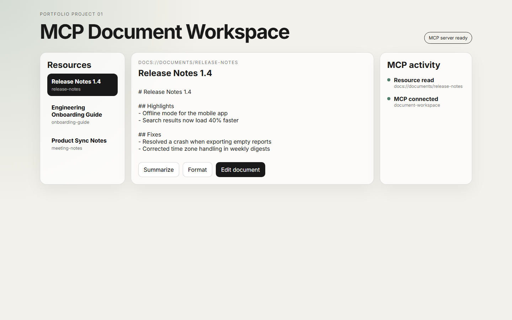

# MCP Document Workspace

A compact portfolio application that demonstrates Model Context Protocol primitives through a real Angular-to-MCP workflow.

The Python backend exposes documents as MCP Resources, a safe edit Tool, and reusable Prompts. A FastAPI bridge owns an MCP Client, and the Angular frontend consumes that bridge over HTTP.

**Status: portfolio-ready core complete.**



For a guided explanation of how each MCP concept maps to the code, see [docs/learning-map.md](docs/learning-map.md).

## End-to-end flow

```text
Angular UI
   ↓ HTTP
FastAPI bridge
   ↓ MCP Client
MCPServer 2.x
   ↓
Resources / Tools / Prompts
   ↓
DocumentStore
```

## MCP surface

| Primitive | Identifier | Purpose |
| --- | --- | --- |
| Resource | `docs://documents` | JSON index of documents |
| Resource template | `docs://documents/{doc_id}` | Read one document |
| Tool | `edit_document` | Replace one exact passage |
| Prompt | `summarize` | Render a summary instruction |
| Prompt | `format` | Render a Markdown-formatting instruction |

## Repository layout

```text
backend/
  src/document_workspace/
    server.py     MCP server
    bridge.py     MCP client adapter
    api.py        FastAPI HTTP bridge
    store.py      document domain/store
frontend/
  src/app/
    workspace-api.service.ts
    app.ts / app.html / app.scss
docs/
  architecture.md
.github/workflows/
  ci.yml
```

## Run locally

Backend:

```powershell
cd backend
python -m venv .venv
.\.venv\Scripts\Activate.ps1
pip install -e ".[dev]"
document-workspace-api
```

Frontend:

```powershell
cd frontend
npm install
npm start
```

Open `http://localhost:4200`.

## Run with Docker

```powershell
docker compose up --build
```

Then open `http://localhost:4200`. The backend is exposed on `http://localhost:8000`.

## Verify

Backend:

```powershell
pytest
ruff check .
```

Frontend:

```powershell
npm run build
npm test -- --watch=false --browsers=ChromeHeadless
```

The standalone MCP server can also be explored directly:

```powershell
document-workspace
npx @modelcontextprotocol/inspector document-workspace
```

GitHub Actions runs the backend tests/lint and frontend build/tests on pushes to `main` and on pull requests.

## Current behavior

The document list and document content are loaded through MCP Resources. Editing calls the MCP `edit_document` Tool. Summarize and Format retrieve server-defined MCP Prompts and display the rendered prompt in the UI.

No model API key is required. Prompt retrieval and model execution are intentionally separate so the MCP concepts stay visible and independently testable.

## Optional extensions

- execute rendered prompts with the Claude API
- persistent document storage
- authentication
- demo GIF
