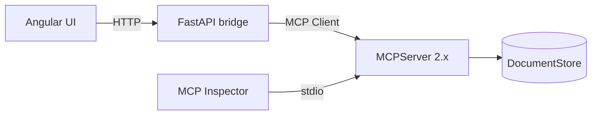
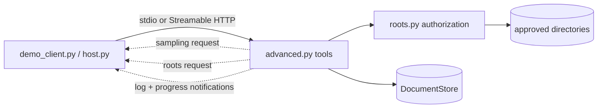

# Architecture

## Overview

Phase 2 connects the browser to the MCP server through a thin HTTP bridge.



The bridge does not duplicate MCP behavior. It translates browser-friendly HTTP requests into real MCP client operations.

## Backend modules

| Module | Responsibility |
| --- | --- |
| `store.py` | In-memory documents and safe exact-text edits |
| `server.py` | MCP Resources, Resource Template, Tool, and Prompts |
| `bridge.py` | High-level MCP Client calls used by the web API |
| `api.py` | FastAPI routes and application lifecycle |
| `schemas.py` | Typed HTTP request/response models |
| `__main__.py` | Standalone stdio MCP server |
| `api_main.py` | Local web API entry point |

## Request flows

### Read a document

```text
Angular
  → GET /api/documents/{id}
  → MCPBridge.get_document()
  → Client.read_resource()
  → docs://documents/{id}
  → MCPServer
  → DocumentStore
```

### Edit a document

```text
Angular
  → POST /api/documents/{id}/edit
  → MCPBridge.edit_document()
  → Client.call_tool("edit_document")
  → MCP Tool
  → DocumentStore.replace_text()
```

### Render a prompt

```text
Angular
  → POST /api/prompts/summarize
  → MCPBridge.render_prompt()
  → Client.get_prompt()
  → MCP Prompt
  → rendered user message
```

## Advanced MCP layer



| Module | Responsibility |
| --- | --- |
| `advanced.py` | `create_advanced_server()`: core server plus `summarize_document`, `list_root_documents`, `read_root_document`, `analyze_document` |
| `roots.py` | Resolves paths and enforces that they stay inside client-approved roots; no SDK dependency |
| `host.py` | Client side: sampling callback with a pluggable model, roots callback, notification recorder |
| `serve.py` | CLI for stdio and Streamable HTTP (`--advanced`, `--stateless`, `--json-response`) |
| `demo_client.py` | Demo host that prints tool results and notifications |

### How the server reaches the client

Sampling and roots are requested through the SDK's `Resolve(...)` resolvers returning `Sample(...)` / `ListRoots()`, not by calling `ctx.session.create_message()` / `list_roots()`:

- On a 2025-era connection the SDK sends a real server-to-client request during the tool call.
- On a 2026-07-28 connection servers may not send requests. The SDK returns an `InputRequiredResult`; the client runs its sampling/roots callback and retries the call with the answers.

The direct `ctx.session` calls raise `NoBackChannelError` on 2026-07-28, which is what `mcp.Client` negotiates by default, so the resolver form is the one that works in both eras.

### Roots authorization

The protocol only tells the server which roots the client approves; it does not stop the server from reading elsewhere. `roots.py` therefore checks every request itself: only local `file://` roots are accepted, the requested path is resolved (following `..` and symlinks) and must be inside a resolved root, only UTF-8 `.md` / `.markdown` / `.txt` files up to 200 000 bytes are readable, and no roots means everything is denied. Roots are requested on every call and never cached.

### Logging and progress

`analyze_document` calls `ctx.info(...)` and `ctx.report_progress(...)`. The client receives progress through `call_tool(progress_callback=...)` and logs through `logging_callback`. On 2026-07-28 log delivery is opt-in per request: the client must set `log_level`; a `logging_callback` alone receives nothing.

SDK note: mcp 2.3.0 marks logging, sampling and roots as deprecated as of protocol 2026-07-28 (SEP-2577). `ctx.info` emits `MCPDeprecationWarning`; the warning is left visible rather than suppressed.

### Transports

- **STDIO**: one client, one subprocess, a duplex pipe. Everything works in both protocol eras.
- **Streamable HTTP, stateful (default)**: 2025-era clients get an `Mcp-Session-Id` and SSE streams, which carry server-to-client requests and notifications. 2026-07-28 clients send self-contained POSTs and are routed past the session logic entirely; notifications ride that POST's SSE response.
- **`--stateless`**: no session tracking, so any worker can serve any request, but a 2025-era client loses sampling and roots (no back-channel).
- **`--json-response`**: each POST gets a single JSON body. Simplest for proxies and plain HTTP clients, but log and progress notifications are dropped in both eras.

The README has the measured feature matrix.

## Design decisions

- The web API owns one MCP Client for its application lifetime.
- The MCP Client connects to the MCPServer through the SDK's in-process transport.
- The standalone stdio entry point remains available for MCP Inspector and other MCP hosts.
- The Angular frontend never reaches into the document store directly.
- Editing stays constrained to exact text replacement so rejected edits are non-destructive.
- Prompt rendering and model execution are separate concerns; no Claude API key is required yet.

## Testing

Backend tests cover the store, direct MCP protocol behavior, and the HTTP bridge. `test_advanced.py` runs every advanced tool through a real client in both protocol eras, `test_roots.py` covers the authorization rules, and `test_transports.py` uses a real stdio subprocess and a real uvicorn server for the stateful, stateless and JSON-response modes. Frontend tests cover bootstrap and rendering. Production build and headless browser tests are part of the local verification workflow.
