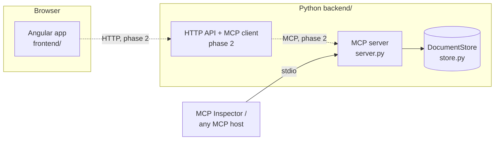

# Architecture

## Overview

The project is split into three layers with one responsibility each. Phase 1
delivers the MCP server and the frontend shell; the bridge between them is
phase 2.

Solid lines exist today; dashed lines are planned.

## Backend

| Module        | Responsibility                                                         |
| ------------- | ---------------------------------------------------------------------- |
| `store.py`    | `DocumentStore`: in-memory documents, lookup, and the edit rule.       |
| `server.py`   | `create_server(store)`: maps the store onto MCP primitives.            |
| `__main__.py` | Entry point; runs the server over stdio.                               |

### MCP surface

| Primitive         | Identifier                  | Behaviour                                      |
| ----------------- | --------------------------- | ---------------------------------------------- |
| Resource          | `docs://documents`          | JSON index: `id`, `title`, `uri` per document. |
| Resource template | `docs://documents/{doc_id}` | Document content as `text/markdown`.           |
| Tool              | `edit_document`             | Replaces one exact passage.                    |
| Prompt            | `summarize`                 | User message asking for a short summary.       |
| Prompt            | `format`                    | User message asking for a Markdown reformat.   |

### Design decisions

- **Server factory, not a module-level singleton.** `create_server(store)`
  takes its store as an argument, so every test builds an isolated server and
  the storage backend can change without touching the protocol layer.
- **Edits are exact find-and-replace.** `edit_document` takes `old_text` and
  `new_text` rather than whole-document content. The edit is rejected unless
  `old_text` matches exactly once, the result stays under a size limit, and the
  document id exists. A caller can therefore never change more than it quoted,
  and a rejected edit leaves the document untouched.
- **Domain errors stay in the store.** The store raises `DocumentNotFoundError`
  and `EditError`; the server translates them into MCP errors
  (`ResourceNotFoundError`, `ToolError`) at the boundary.
- **In-memory storage.** Sample documents are seeded on start and edits last
  for the lifetime of the process, which is enough for the MVP and keeps tests
  deterministic.

### Testing

`tests/test_server.py` connects an in-process MCP `Client` to the server, so
each test exercises real protocol requests (`resources/list`,
`resources/templates/list`, `resources/read`, `tools/call`, `prompts/get`)
rather than calling Python functions directly. `tests/test_store.py` covers the
edit rule on its own.

## Frontend

An Angular standalone application using SCSS and the router. In phase 1 it is a
static shell with a responsive three-panel layout (resources, document,
activity) and no backend calls.

## Out of scope for phase 1

Authentication, a database, cloud deployment, the MCP client and HTTP API, and
containerisation. A `docker-compose.yml` is deliberately absent: the only
runnable service is a stdio server, which has nothing to expose until the HTTP
API exists.
