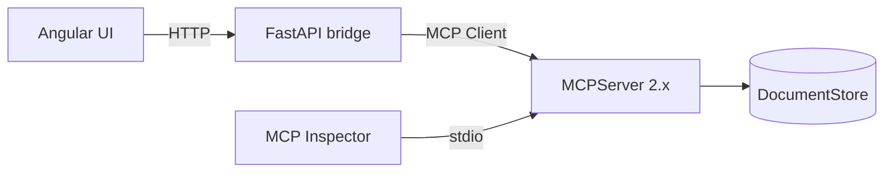

# Architecture

## Overview

Phase 2 connects the browser to the MCP server through a thin HTTP bridge.



The bridge does not duplicate MCP behavior. It translates browser-friendly HTTP requests into real MCP client operations.

## Backend modules

| Module | Responsibility |
| --- | --- |
| `store.py` | In-memory documents and safe exact-text edits |
| `server.py` | MCP Resources, Resource Template, Tool, and Prompts |
| `bridge.py` | High-level MCP Client calls used by the web API |
| `api.py` | FastAPI routes and application lifecycle |
| `schemas.py` | Typed HTTP request/response models |
| `__main__.py` | Standalone stdio MCP server |
| `api_main.py` | Local web API entry point |

## Request flows

### Read a document

```text
Angular
  → GET /api/documents/{id}
  → MCPBridge.get_document()
  → Client.read_resource()
  → docs://documents/{id}
  → MCPServer
  → DocumentStore
```

### Edit a document

```text
Angular
  → POST /api/documents/{id}/edit
  → MCPBridge.edit_document()
  → Client.call_tool("edit_document")
  → MCP Tool
  → DocumentStore.replace_text()
```

### Render a prompt

```text
Angular
  → POST /api/prompts/summarize
  → MCPBridge.render_prompt()
  → Client.get_prompt()
  → MCP Prompt
  → rendered user message
```

## Design decisions

- The web API owns one MCP Client for its application lifetime.
- The MCP Client connects to the MCPServer through the SDK's in-process transport.
- The standalone stdio entry point remains available for MCP Inspector and other MCP hosts.
- The Angular frontend never reaches into the document store directly.
- Editing stays constrained to exact text replacement so rejected edits are non-destructive.
- Prompt rendering and model execution are separate concerns; no Claude API key is required yet.

## Testing

Backend tests cover the store, direct MCP protocol behavior, and the HTTP bridge. Frontend tests cover bootstrap and rendering. Production build and headless browser tests are part of the local verification workflow.
